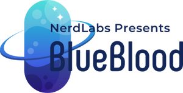

<!--
*** Thanks for checking out the Best-README-Template. If you have a suggestion
*** that would make this better, please fork the repo and create a pull request
*** or simply open an issue with the tag "enhancement".
*** Thanks again! Now go create something AMAZING! :D
-->


<!-- PROJECT SHIELDS -->
<!--
*** I'm using markdown "reference style" links for readability.
*** Reference links are enclosed in brackets [ ] instead of parentheses ( ).
*** See the bottom of this document for the declaration of the reference variables
*** for contributors-url, forks-url, etc. This is an optional, concise syntax you may use.
*** https://www.markdownguide.org/basic-syntax/#reference-style-links
-->

<!-- PROJECT LOGO -->
<br />
<p align="center">
    

  <h1 align="center">BlueBlood Android Java Application</h1>

</p>


<!-- TABLE OF CONTENTS -->
<details open="open">
  <summary>Table of Contents</summary>
  <ol>
    <li><a href="#acknowledgements">Acknowledgements</a></li>
    <li>
      <a href="#about-the-project">About The Project</a>
      <ul>
        <li><a href="#built-with">Built With</a></li>
      </ul>
    </li>
    <li>
      <a href="#getting-started">Getting Started</a>
      <ul>
        <li><a href="#prerequisites">Prerequisites</a></li>
        <li><a href="#installation">Installation</a></li>
      </ul>
    </li>
    <li><a href="#usage">Usage</a></li>
    <!--<li><a href="#roadmap">Roadmap</a></li>-->
    <li><a href="#contributing">Contributing</a></li>
    <li><a href="#license">License</a></li>
    <li><a href="#contributors">Contributors</a></li>
  </ol>
</details>

## Acknowledgements

<p align="center"><a href="https://www.sliit.lk/" target="_blank"></a></p>

This is a project done for the Mobile Application Development module of BSc.(Hons.) Degree in Information Technology in Sri Lanka Institute of Information Technology


<!-- ABOUT THE PROJECT -->
## About The Project

<!--[![Product Name Screen Shot][product-screenshot]](https://example.com)-->
<p>
The brand-new BlueBlood mobile app is your complete healthcare solution, powered by NerdLabs. Channel doctors from major private hospitals, order or deliver drugs, do home tests with results sent directly to your mobile and access all your reports from BlueBlood health profile, with just one click.</p>

<p>Why Use Our Application?
<ol>
<li>	Search for a doctor/consultant by name, specialty, hospital, or date to easily book an appointment at a range of hospitals on the island. View your booking history and book the same doctor again. </li>

<li>Ongoing Number – No more waiting at hospitals to meet your doctor. Check the ongoing appointment number of your doctor session from your mobile.</li>

<li>Medicine Delivery – With just a few clicks, you can have medication delivered to your door by uploading an image of your prescription to the mobile app.</li>

<li>Mobile Laboratory & Lab Test Booking – Schedule a lab test or complete it at home, and your results will be sent right to your mobile app.</li>

<li>Online Lab Reports – Access your lab reports from leading laboratory services/hospitals directly from your mobile via the BlueBlood Mobile app.</li>

<li>My Health Profile – Store and manage all your health records and reports in your own BlueBlood profile. </li>
</ol>
### Built With

This section shows the list of major technologies that we have used to  built our project . 
* Language : [Java 17](https://www.java.com/en/)


<p align="center"><a href=https://www.oracle.com/java/technologies/downloads/#java17" target="_blank"></a></p>


* Development Environment : [Android Studio 2021.3.1](https://developer.android.com/studio?gclsrc=ds&gclsrc=ds&gclid=CMfRvbCWqPACFZSzjgodgn8HSg)

<p align="center"><a href="https://developer.android.com/studio?gclsrc=ds&gclsrc=ds&gclid=CMfRvbCWqPACFZSzjgodgn8HSg" target="_blank"></a></p>

* Database : [SQLite](https://www.sqlite.org/index.html)

<p align="center"><a href="https://www.sqlite.org/index.html" target="_blank"></a></p>


<!-- GETTING STARTED -->
## Getting Started

In order to be fully funtional and uprunning the following should be followed

### Prerequisites

The following applications must be installed
* Java 17 - jdk
* Java 17 - JRE
* Android Studio 2021.3.1

### Installation


1. Clone the repository
   ```sh
   git clone https://github.com/it21062742/Nerd-Labs.git
   ```
2. Open the Application using Android Studio


 

<!-- USAGE EXAMPLES -->
## Usage

Use this space to show useful examples of how a project can be used. Additional screenshots, code examples and demos work well in this space. You may also link to more resources.

_For more examples, please refer to the [Documentation](https://example.com)_


<!-- LICENSE -->
## License

Distributed under the MIT License. See `LICENSE` for more information.


## Contributors
* IT21062742 - Weerasinghe D.J.A.H - [it21062742](https://github.com/it21062742)
* IT21042324 - Reezan S.A - [Reezan Saleem](https://github.com/IT21042324)
* IT20261382 - Madusanka K.M.I - [kulesekara](https://github.com/kulesekara)
* IT21002724 - Caldera H.G - [it21002724](https://github.com/it21002724)


